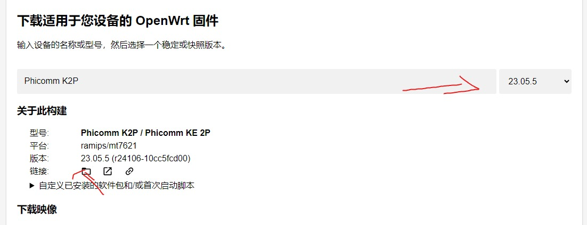
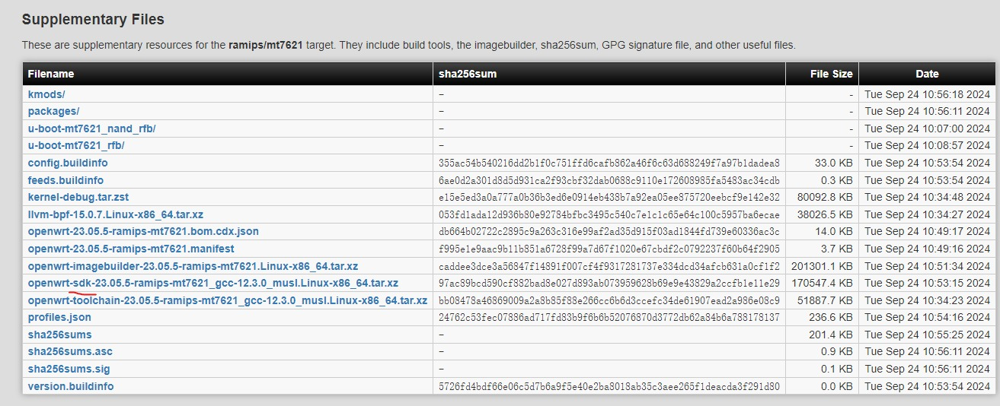

# sdk-action

fork 后会自动切到自己的仓库：
   1. 切到Action页面
   2. 选择”编译 OpenWrt 插件“工作流
   3. 点击run workflow按钮   . 填写信息
   4. 点击Run workflow

接下来会自动执行编译，编译时间快的可能2，3分钟，取决于插件本身的编译时间

编译完成后，点击对应工作，可查看编译好的插件压缩包，压缩包中包含了你需要编译的插件以及所有依赖软件包

下载解压后找到需要的ipk文件

将ipk文件传到路由器后台，使用 opkg 命令安装.
# 1.自动版本，当前主分支 [点击这里](https://firmware-selector.openwrt.org/) 
   在官网输入设备名称后，会显示平台,如：ramips/mt7621。复制到Action中

# 2.手动填写源码版本，[切换到源码分支](../../tree/sourcecode)
   在源码分支中，获取 OpenWrt 官方源码（[点击这里](https://firmware-selector.openwrt.org/)）,然后填写地址

下拉到最下面选择SDK

## 可选的包

<table width="100%">
   <thead>
      <tr>
         <th>仓库</th>
         <th>名称</th>
      </tr>
   </thead>
   <tbody>
      <tr>
         <td>https://github.com/openwrt-packages/openwrt-vlmcsd</td>
         <td>openwrt-vlmcsd</td>
      </tr>
      <tr>
         <td>https://github.com/openwrt-packages/luci-app-vlmcsd</td>
         <td>luci-app-vlmcsd</td>
      </tr>
      <tr>
         <td>https://github.com/openwrt-packages/helloworld</td>
         <td>luci-app-ssr-plus</td>
      </tr>
      <tr>
         <td>https://github.com/openwrt-packages/luci-app-bandwidthd</td>
         <td>luci-app-bandwidthd</td>
      </tr>
      <tr>
         <td>https://github.com/openwrt-packages/luci-app-clash</td>
         <td>luci-app-clash</td>
      </tr>
   </tbody>
</table>p